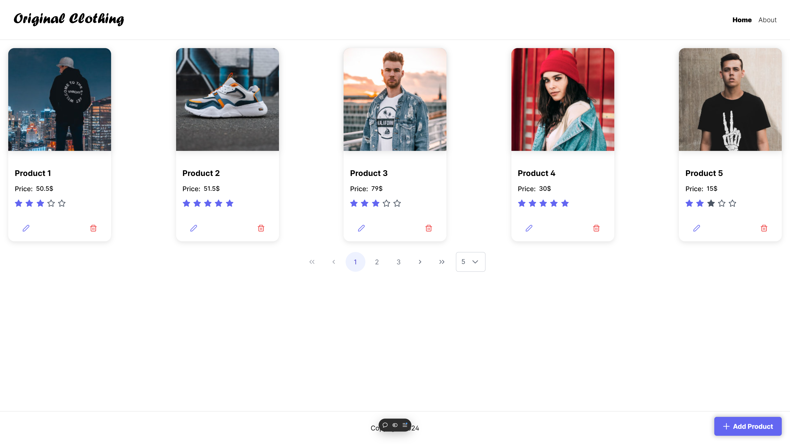
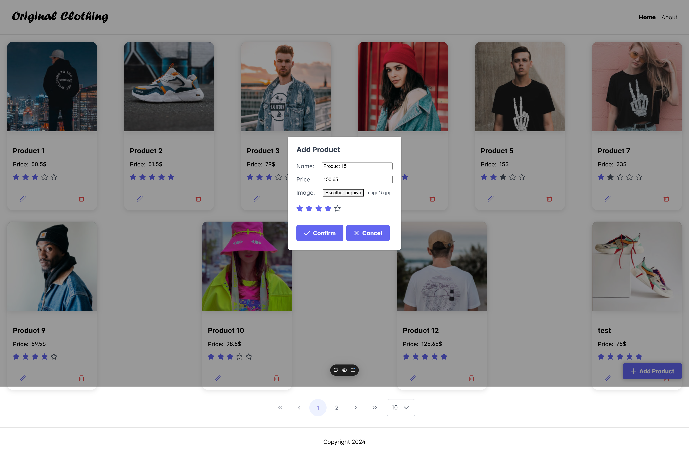
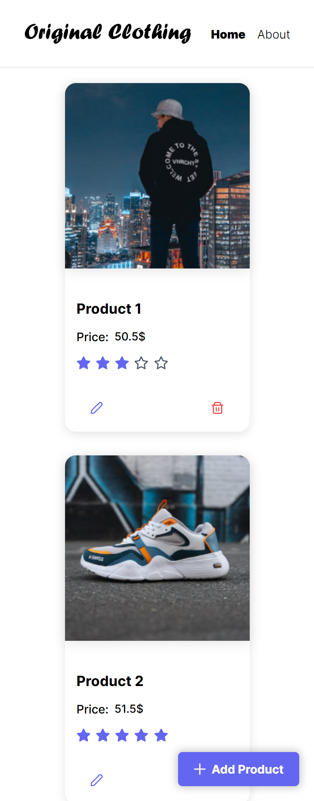
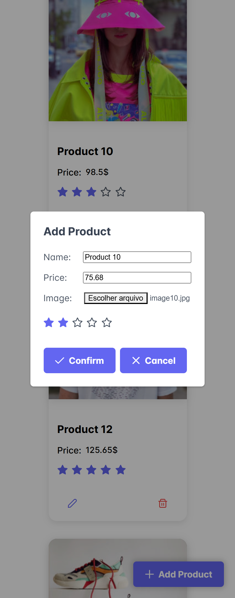

# Angular Store

## Overview

Os usuários devem ser capazes de:

- Criar, visualizar, editar e deletar produtos.
- Selecionar a página e a quantidade de produtos por página.

### Screenshots

#### Desktop

#### Mobile

## Tecnologias

### Feito com

- Angular 18
- Node
- Express
- MongoDB Atlas
- Cloudinary

## Autor

- GitHub - [Philipe Mello](https://github.com/Philipessj1)
- Link do App - [Angular Store](https://angular-store-indol.vercel.app/)